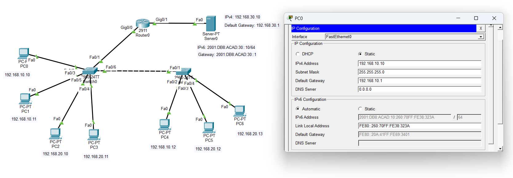

# multi-department-network-infrastructure-simulation

A comprehensive enterprise network infrastructure designed, configured, and simulated using Cisco Packet Tracer. This project demonstrates the integration of modern networking standards, including dual-stack addressing, automated configuration protocols, and multi-departmental routing.

## Network Topology

## Key Features & Technologies
* **Dual-Stack Addressing:** Simultaneous implementation of **IPv4 static addressing** and **IPv6**.
* **SLAAC (Stateless Address Autoconfiguration):** Configured to allow end-user devices to automatically generate their own unique IPv6 addresses using the router's prefix, eliminating the need for a central DHCPv6 server.
* **Multi-Departmental Isolation & Routing:** Structured network segments to mimic a realistic corporate environment with efficient inter-departmental communication.

## Network Architecture
* **Core Router:** Handles inter-VLAN/inter-departmental traffic and broadcasts IPv6 router advertisements for SLAAC.
* **Switches:** Distributed across departments to manage local endpoint connections.
* **Endpoints:** PCs and local network resources configured to dynamically acquire IPv6 parameters.

## How to Run the Simulation
1. Download and install **Cisco Packet Tracer**.
2. Clone this repository or download the `.pkt` file directly.
3. Open `network_simulation.pkt` inside Cisco Packet Tracer.
4. Use the **Simulation Mode** or the **Desktop Command Prompt** on any PC to ping across departments to verify connectivity (`ping` or `pingv6`).
